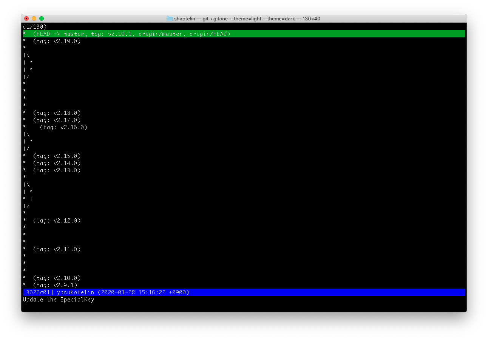

# gitone

gitone is simple git tree viwer in TUI(text user interface) application!<br>
This app is inspired [tig](https://github.com/jonas/tig) and [GitUp](https://github.com/git-up/GitUp).

Supported macOS, Linux and Windows.


## Requirement

- Go >= 1.11
- git
- less

## Installation

### go get

This uses the Go modules. Thus you have to use `go get` with `GO111MODULE=on`.

```
GO111MODULE=on go get -u github.com/yasukotelin/gitone
```

### From source

If you don't want to use `go get`, you can install from source easily.

```
git clone https://github.com/yasukotelin/gitone.git
cd gitone
go install
```

## Usage

This app only displays git logs. And when you input the enter or space on the commit hash, this will run `git show` with less command.

### Key

gitone offers simple key bindings and also like `less` key bindigs.

| Key1         | Key2     | Motion                                          |
|--------------|----------|-------------------------------------------------|
| Enter        | Space    | execute the `git show` with less command        |
| Ctrl + Space | s        | execute the `git show --stat` with less commadn |
| q            | Ctrl + c | app stop (when on the git log)                  |
| q            |          | Back to git log (when on the `git show`)        |
| Down key     | j        | Cursor down                                     |
| Up key       | k        | Cursor up                                       |
| Home key     | g        | Jump to top line                                |
| End key      | G        | Jump to bottom line                             |
| PgDn key     | Ctrl + d | down to 5 line                                  |
| pgUp key     | Ctrl + u | up to 5 line                                    |

### Theme

This app prepares a few themes for background dark or light users.

#### dark

dark is default theme.

```
gitone --theme=dark
```



#### light

```
gitone --theme=light
```


#### solid dark

```
gitone --theme=soliddark
```


#### solid light

```
gitone --theme=solidlight
```


## Windows

This app can be used from windows.

If you want to run on the git bash, you have to add `winpty` like a below.

```
winpty gitone
```

## Author

yasukotelin
